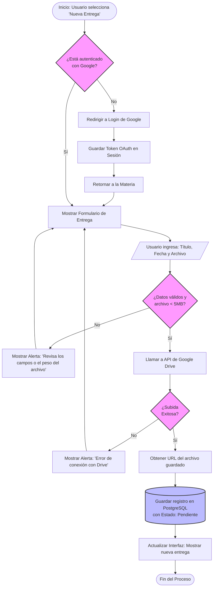
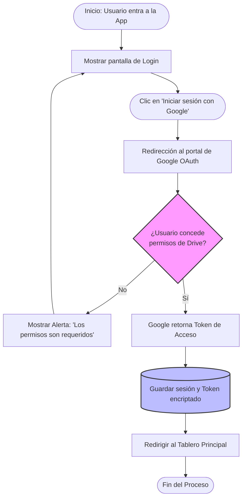

# 🔄 Diagrama de Flujo: Subida de Entrega

Este diagrama detalla la lógica de decisión y el flujo de datos al momento de registrar una nueva tarea y subir su archivo adjunto a Google Drive.


---
## 🔐 Diagrama de Flujo: Inicio de Sesión y Autorización (CU-01)

Este diagrama representa el flujo de autenticación mediante OAuth 2.0 con Google.


---
## 🔐 Diagrama de Flujo: Registrar Materia y Crear Carpeta (CU-02)
```mermaid
flowchart TD
    A([Inicio: Selecciona 'Añadir Materia']) --> B[Mostrar Formulario]
    B --> C[/Ingresa: Nombre y Profesor/]
    C --> D{¿Campos vacíos o<br>caracteres inválidos?}
    
    D -- Sí --> E[Mostrar Alerta: 'Completa todos los datos correctamente']
    E --> B
    
    D -- No --> F[(Insertar Materia en PostgreSQL)]
    F --> G[Llamar a API: Crear Carpeta en Drive]
    G --> H{¿Se creó la<br>carpeta con éxito?}
    
    H -- No --> I[Mostrar Alerta de Error de API]
    I --> J[(Rollback: Eliminar Materia de PostgreSQL)]
    J --> B
    
    H -- Sí --> K[Obtener URL de la nueva carpeta]
    K --> L[(Actualizar Materia en PostgreSQL con la URL)]
    L --> M[Actualizar Interfaz: Mostrar nueva materia]
    M --> N([Fin del Proceso])

    style D fill:#f9f,stroke:#333,stroke-width:2px
    style H fill:#f9f,stroke:#333,stroke-width:2px
    style F fill:#bbf,stroke:#333,stroke-width:2px
    style J fill:#bbf,stroke:#333,stroke-width:2px
    style L fill:#bbf,stroke:#333,stroke-width:2px
    ```